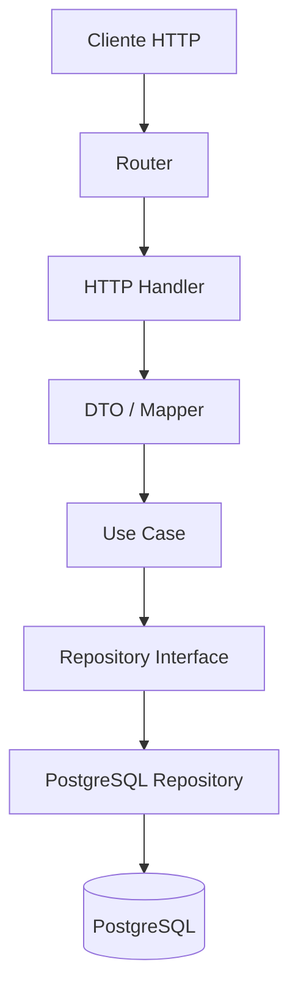
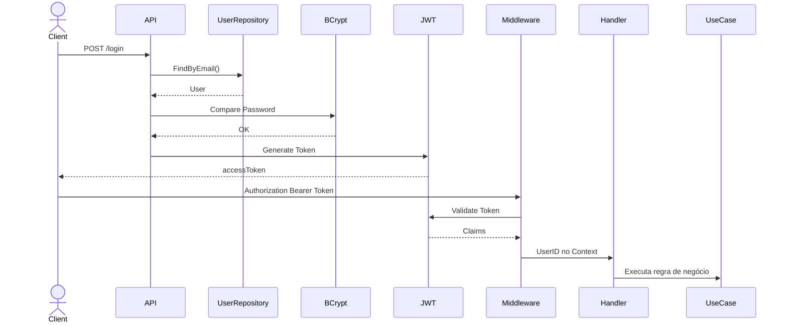
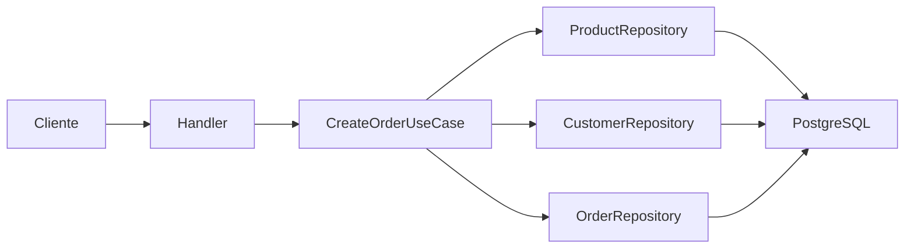

# Clean Architecture

```mermaid
flowchart TB

Client["Cliente HTTP"]

Router["Router"]

Handler["HTTP Handler"]

DTO["DTO / Mapper"]

UseCase["Use Case"]

Repository["Repository Interface"]

Postgres["PostgreSQL Repository"]

Database[("PostgreSQL")]

Client --> Router

Router --> Handler

Handler --> DTO

DTO --> UseCase

UseCase --> Repository

Repository --> Postgres

Postgres --> Database
```

# Fluxo de Autenticação

```mermaid
sequenceDiagram

actor Client

Client->>API: POST /login

API->>UserRepository: FindByEmail()

UserRepository-->>API: User

API->>BCrypt: Compare Password

BCrypt-->>API: OK

API->>JWT: Generate Token

JWT-->>Client: accessToken

Client->>Middleware: Authorization Bearer Token

Middleware->>JWT: Validate Token

JWT-->>Middleware: Claims

Middleware->>Handler: UserID no Context

Handler->>UseCase: Executa regra de negócio
```

# Fluxo de Criação do Pedido

```mermaid
flowchart LR

Cliente --> Handler

Handler --> CreateOrderUseCase

CreateOrderUseCase --> CustomerRepository

CreateOrderUseCase --> ProductRepository

CreateOrderUseCase --> OrderRepository

ProductRepository --> PostgreSQL

CustomerRepository --> PostgreSQL

OrderRepository --> PostgreSQL
```

