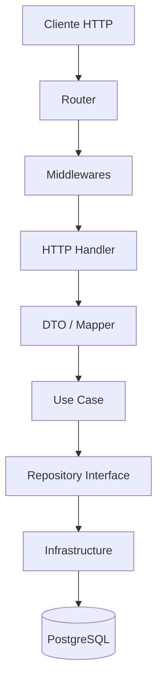
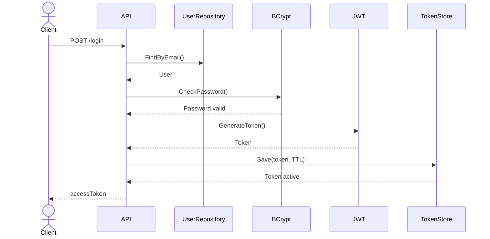
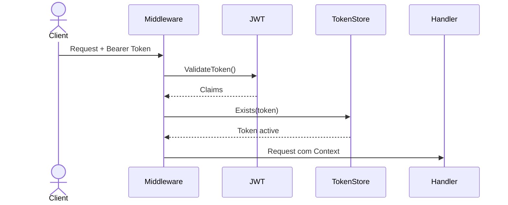
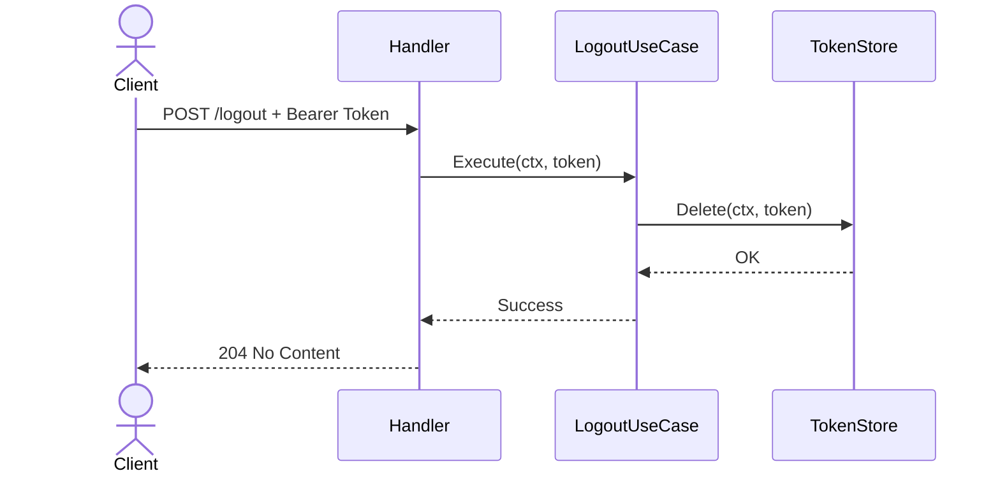
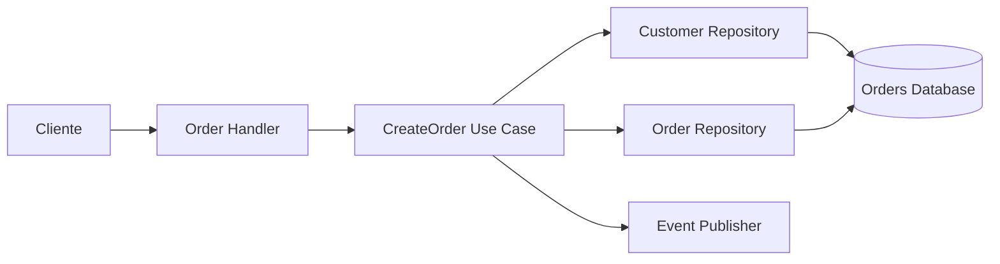
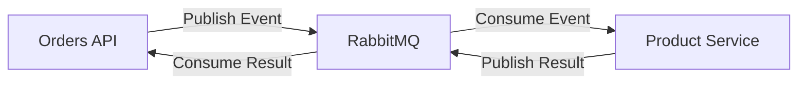
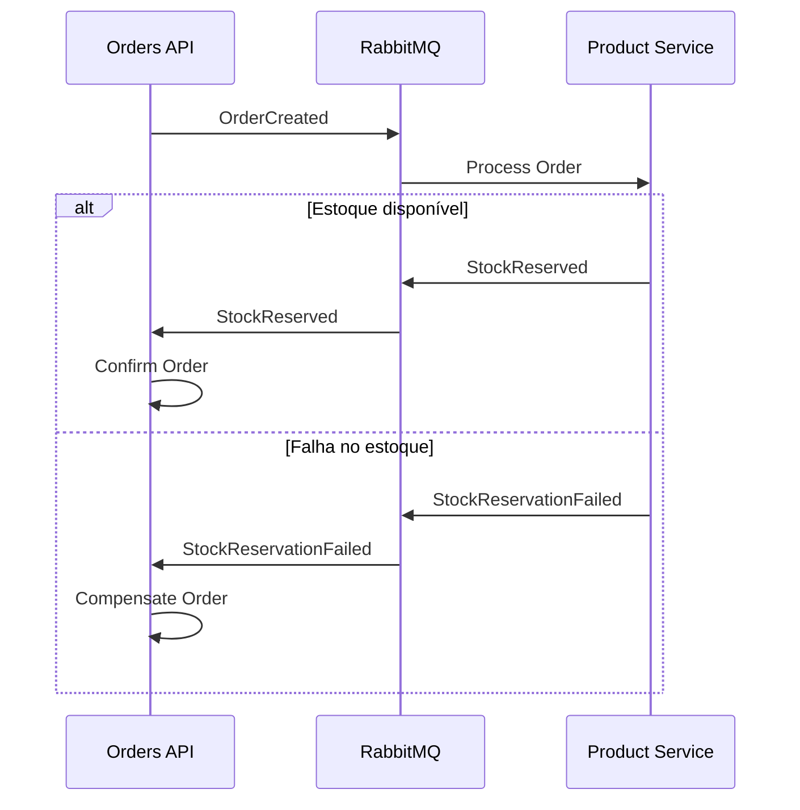
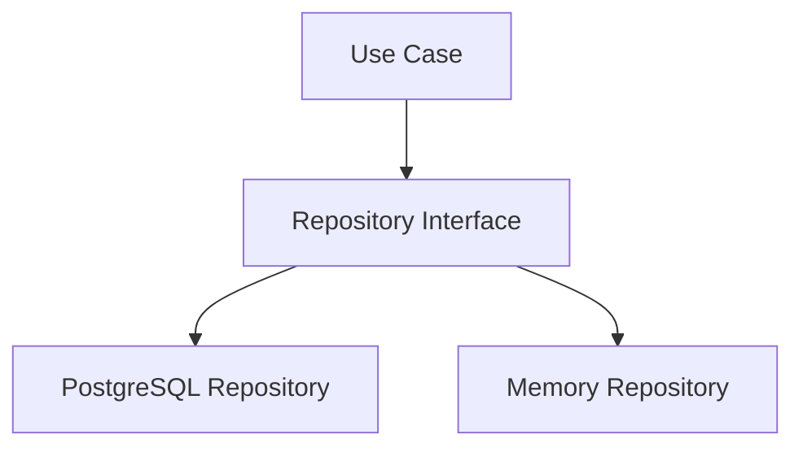

# Arquitetura

Este projeto evoluiu de uma API REST monolítica para uma solução distribuída,
mantendo os princípios de **Clean Architecture**, **SOLID** e separação clara
entre domínio, aplicação e infraestrutura.

A solução é composta por serviços independentes que se comunicam
assincronamente através do RabbitMQ em determinados fluxos de negócio.

---

# Clean Architecture

Cada serviço mantém suas regras de negócio independentes de detalhes externos
como HTTP, banco de dados, mensageria ou cache.



---

# Fluxo de Autenticação

O sistema utiliza JWT para autenticação.



---

# Middleware de Autenticação

As rotas protegidas passam pelo middleware de autenticação.

O middleware valida:

- Presença do header `Authorization`;
- Formato `Bearer <token>`;
- Validade do JWT;
- Existência do token ativo no `TokenStore`.



---

# Fluxo de Logout

O logout invalida o token ativo.

Após o logout, o token não deve mais ser considerado válido.



---

# Fluxo de Criação de Pedido

A criação de pedidos envolve validações de domínio e persistência.

Quando o fluxo exige comunicação com outro serviço, a integração ocorre
através do broker.



---

# Comunicação Assíncrona

A comunicação entre os serviços utiliza RabbitMQ.

Os serviços não acessam diretamente o banco de dados uns dos outros.

Cada serviço é responsável pelos seus próprios dados.



---

# Saga

O fluxo distribuído é implementado utilizando uma Saga.

A Saga permite manter consistência entre serviços sem utilizar transações
distribuídas.



---

# Idempotência

Mensagens podem ser entregues mais de uma vez pelo broker.

Por esse motivo, o processamento deve impedir que uma mensagem repetida
corrompa o estado da aplicação.

```text
Message ID
     │
     ▼
Já processada?
     │
 ┌───┴────┐
 │        │
Sim      Não
 │        │
 ▼        ▼
Ignore   Process
```

---

# Estrutura da Solução

```text
orders-api/

├── cmd/
│   └── api/
│
├── config/
│
├── docs/
│
├── infrastructure/
│   ├── cache/
│   ├── database/
│   ├── http/
│   │   ├── handler/
│   │   ├── middleware/
│   │   └── routes/
│   ├── logging/
│   ├── messaging/
│   │   └── rabbitmq/
│   └── repository/
│       ├── memory/
│       └── postgres/
│
├── internal/
│   ├── app/
│   ├── domain/
│   ├── dto/
│   ├── mapper/
│   ├── messaging/
│   ├── repository/
│   ├── security/
│   └── usecase/
│
├── migrations/
│
├── scripts/
│
├── examples/
│
└── tests/
    └── integration/
```

---

# Princípios Aplicados

## SOLID

### Single Responsibility Principle

Cada componente possui uma responsabilidade principal.

Exemplos:

- Handler → HTTP;
- Use Case → regra de aplicação;
- Repository → persistência;
- Entity → regras do domínio;
- Middleware → processamento transversal das requisições;
- TokenStore → gerenciamento do estado dos tokens.

---

### Open/Closed Principle

Novas implementações podem ser adicionadas sem modificar os casos de uso.

Exemplo:

```text
UserRepository
      │
      ├── MemoryUserRepository
      │
      └── PostgreSQLUserRepository
```

---

### Liskov Substitution Principle

Qualquer implementação compatível com uma interface pode substituir outra.

Exemplo:

```text
TokenStore
    │
    ├── MemoryTokenStore
    │
    └── RedisTokenStore
```

---

### Interface Segregation Principle

As interfaces representam contratos específicos da aplicação.

Exemplos:

- `UserRepository`;
- `OrderRepository`;
- `ProductRepository`;
- `TokenStore`;
- interfaces específicas dos Use Cases utilizadas pelos handlers.

---

### Dependency Inversion Principle

Os casos de uso dependem de abstrações, e não de implementações concretas.

